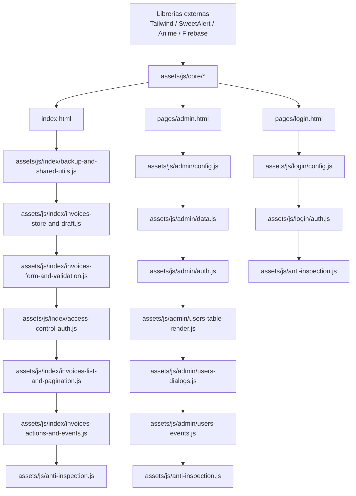

# Sistema de Facturación Electrónica / Electronic Billing System

Aplicación web para gestión de facturas con autenticación en Firebase y panel de administración de usuarios.

Web app for invoice management with Firebase authentication and an admin user panel.

## URL pública / Public URL (GitHub Pages)

- Sitio / Site: [https://jstex.github.io/sistema-facturacion-electronica/](https://jstex.github.io/sistema-facturacion-electronica/)
- Login: [https://jstex.github.io/sistema-facturacion-electronica/pages/login.html](https://jstex.github.io/sistema-facturacion-electronica/pages/login.html)
- Admin: [https://jstex.github.io/sistema-facturacion-electronica/pages/admin.html](https://jstex.github.io/sistema-facturacion-electronica/pages/admin.html)

## Estructura del proyecto / Project Structure

```text
.
├── index.html
├── LICENSE
├── README.md
├── assets/
│   ├── css/
│   │   └── app.css
│   ├── js/
│   │   ├── anti-inspection.js
│   │   ├── admin/
│   │   │   ├── auth.js
│   │   │   ├── config.js
│   │   │   ├── data.js
│   │   │   ├── users-dialogs.js
│   │   │   ├── users-events.js
│   │   │   └── users-table-render.js
│   │   ├── core/
│   │   │   ├── firebase-utils.js
│   │   │   ├── list-utils.js
│   │   │   ├── loading-utils.js
│   │   │   ├── password-utils.js
│   │   │   ├── session-utils.js
│   │   │   ├── status-utils.js
│   │   │   ├── theme-utils.js
│   │   │   └── toast-utils.js
│   │   ├── index/
│   │   │   ├── access-control-auth.js
│   │   │   ├── backup-and-shared-utils.js
│   │   │   ├── invoices-actions-and-events.js
│   │   │   ├── invoices-form-and-validation.js
│   │   │   ├── invoices-list-and-pagination.js
│   │   │   └── invoices-store-and-draft.js
│   │   └── login/
│   │       ├── auth.js
│   │       └── config.js
│   └── external/
│       ├── files/
│       ├── images/
│       └── videos/
├── config/
│   └── firebase-inicial.json
├── docs/
│   ├── CONVENCION_MODULOS_JS.md
│   └── INSTRUCCIONES_FIREBASE.md
├── pages/
│   ├── admin.html
│   └── login.html
└── templates/
    ├── plantilla-base.html
    └── plantilla-formulario.html
```

## Notas / Notes

- Usa rutas relativas entre `index.html`, `pages/` y `assets/`.
- Use relative paths between `index.html`, `pages/`, and `assets/`.
- Para recursos multimedia nuevos, usa `assets/external/`.
- For new media resources, use `assets/external/`.
- Documentación Firebase / Firebase docs: `docs/INSTRUCCIONES_FIREBASE.md`.
- Convención de módulos JS / JS module conventions: `docs/CONVENCION_MODULOS_JS.md`.

## Reglas rápidas de módulos JS / Quick JS module rules

1. Separar por **funcionalidad** (auth, render, eventos, validación, backup), no por tamaño arbitrario.
2. Cargar scripts en orden de dependencia: librerías externas → `assets/js/core/*` → módulos de página.
3. Usar nombres descriptivos con guiones (ejemplo: `invoices-form-and-validation.js`).
4. Evitar scripts inline grandes en HTML; mover lógica a `assets/js/<pagina>/`.
5. Cuando haya estado compartido, centralizarlo en un objeto global por página (ejemplo: `window.adminState`).

### Flujo de carga de scripts (Mermaid)



## Ejecutar localmente / Run Locally

### Opción 1: Live Server (VS Code)

- Abre `index.html` y selecciona **Open with Live Server**.
- Open `index.html` and select **Open with Live Server**.

### Opción 2: Python HTTP Server

1. En la raíz del proyecto, ejecuta / From the project root, run:

```bash
python -m http.server 5500
```

1. Abre en el navegador / Open in your browser:

- `http://localhost:5500/`
- `http://localhost:5500/pages/login.html`

## Instalar librerías (CDN) / Install libraries (CDN)

Este proyecto es HTML/CSS/JS estático (sin `package.json`), así que la forma más simple es usar CDN.

This project is static HTML/CSS/JS (no `package.json`), so the easiest approach is using a CDN.

- Agrega el script en el `<head>` de `index.html` (o en la página donde lo usarás).
- Usa la librería desde `window` en tu JavaScript.

- Add the script in the `<head>` of `index.html` (or the specific page where it is used).
- Use the library from `window` in your JavaScript.

Ejemplo / Example (`anime.js`):

```html
<script src="https://cdn.jsdelivr.net/npm/animejs@3.2.2/lib/anime.min.js"></script>
```

```js
if (window.anime) {
    window.anime({
        targets: '.mi-elemento',
        translateY: [0, -4, 0],
        duration: 1200,
        loop: true
    });
}
```

### Librerías recomendadas (CDN) / Recommended libraries (CDN)

| Librería / Library | Úsala para / Use it for | CDN (pegar en head) |
| --- | --- | --- |
| Anime.js | Animaciones UI (badges, notificaciones, transiciones) / UI animations (badges, notifications, transitions) | `<script src="https://cdn.jsdelivr.net/npm/animejs@3.2.2/lib/anime.min.js"></script>` |
| Chart.js | Gráficas de ventas, pagadas vs pendientes, reportes / Sales charts, paid vs pending, reports | `<script src="https://cdn.jsdelivr.net/npm/chart.js"></script>` |
| IMask | Máscaras de input para dinero, NIT, teléfono / Input masks for currency, tax ID, phone | `<script src="https://cdn.jsdelivr.net/npm/imask"></script>` |

## Respaldo manual / Manual backup

- Usa **Exportar** para descargar una copia JSON de las facturas.
- Usa **Importar** para restaurar una copia JSON (reemplaza el dataset actual).
- La app muestra un recordatorio para hacer respaldo manual; no crea copias automáticamente.
- Los respaldos se exportan **cifrados con clave** para proteger datos sensibles.
- **No pierdas la clave del respaldo**: sin esa clave no se puede descifrar ni importar la copia.

## Checklist de publicación / Pre-release checklist

- Verificar login y redirección sin sesión (`pages/login.html`).
- Probar crear, editar, eliminar y deshacer eliminación de facturas.
- Confirmar exportación/importación de respaldo manual.
- Validar PDF (previsualización y descarga).
- Revisar vista activa e historial pagadas.
- Confirmar reglas de Firebase en `docs/INSTRUCCIONES_FIREBASE.md`.
